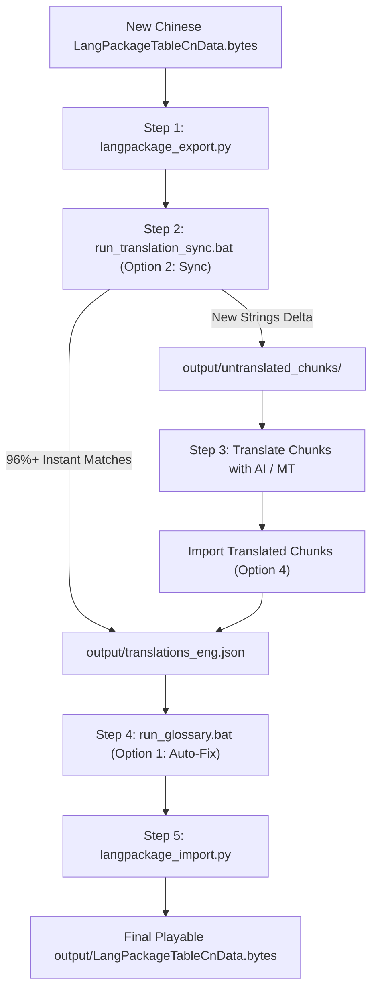

# [GUIDE] GFL2 Translation Toolkit - Detailed Operational Manual

This manual provides complete step-by-step instructions for maintaining **Girls' Frontline 2: Exilium (GFL2)** localization across frequent game updates (every ~20 days), translating new strings, and enforcing lore accuracy using the database-driven glossary.

---

## 📑 Table of Contents

1. [🔄 Updating the Game (Every 20-Day Patch Workflow)](#1--updating-the-game-every-20-day-patch-workflow)
   * [Step 1: Export New Update Text](#step-1-export-new-update-text)
   * [Step 2: Sync with Translation Memory](#step-2-sync-with-translation-memory)
   * [Step 3: Translate New Chunks](#step-3-translate-new-chunks)
   * [Step 4: Audit & Auto-Fix Lore Glossary](#step-4-audit--auto-fix-lore-glossary)
   * [Step 5: Rebuild the Game Binary](#step-5-rebuild-the-game-binary)
2. [🤖 How to Translate Untranslated Chunks](#2--how-to-translate-untranslated-chunks)
   * [Method A: ChatGPT / Claude Web (Recommended for Quality)](#method-a-chatgpt--claude-web-recommended-for-quality)
   * [Method B: Built-in Auto-Translate (Google Translate)](#method-b-built-in-auto-translate-google-translate)
   * [Method C: AI Pair Programmer / Coding Assistant](#method-c-ai-pair-programmer--coding-assistant)
3. [🛡️ Lore Glossary & Terminology Protection (Database-Driven)](#3-️-lore-glossary--terminology-protection-database-driven)
   * [Why Lore Mistranslations Happen](#why-lore-mistranslations-happen)
   * [Enforced Lore Terms & Substitutions](#enforced-lore-terms--substitutions)
   * [Managing the Glossary via `run_glossary.bat`](#managing-the-glossary-via-run_glossarybat)
   * [Adding Custom Terms & JSON Sync](#adding-custom-terms--json-sync)
4. [💡 Best Practices & Pro Tips](#4--best-practices--pro-tips)

---

## 1. 🔄 Updating the Game (Every 20-Day Patch Workflow)

Whenever the game receives a new version update, follow this complete 5-step cycle:



---

### Step 1: Export New Update Text
1. Copy the **new** update's `LangPackageTableCnData.bytes` from your game folder into this folder.
2. Double-click **`langpackage_export.py`** (or run `python langpackage_export.py`).
   * This exports `translations.json` containing the update's new table IDs.
   * Press Enter when prompted to close.

---

### Step 2: Sync with Translation Memory
1. Double-click **`run_translation_sync.bat`** (or run `python gfl2_translation_sync.py`).
2. Select **Option 2** (*Sync New Update*).
3. Press **Enter** to accept the default file paths:
   * Chinese input: `output/translations.json`
   * Output English: `output/translations_eng.json`
4. **What happens**:
   * It matches all existing strings against your local `translation_memory.db` in **< 1 second**.
   * It creates `output/translations_eng.json` (**already ~96% translated**).
   * It detects any brand-new or changed strings from the update and exports them to `output/untranslated_chunks/` (split into ~250 lines per chunk file).

> [!TIP]
> Even if you don't translate the new chunks yet, your game file is already 96% translated and fully playable!

---

### Step 3: Translate New Chunks
Translate the remaining files in `output/untranslated_chunks/` using any of the methods described in [Section 2](#2--how-to-translate-untranslated-chunks).

Once translated, in **`run_translation_sync.bat`**, choose **Option 4** (*Import translated file*) and press Enter.  
* All newly translated strings are merged into `output/translations_eng.json`.
* They are permanently saved into `translation_memory.db` so you never have to translate them again.

---

### Step 4: Audit & Auto-Fix Lore Glossary
Before rebuilding your game file, run the lore auditor to clean up any machine translation quirks (e.g. `Star Abyss` → `Ateraxis`, `Sextant` → `Sextans`, generic `sir` → `Your Excellency`):

1. Double-click **`run_glossary.bat`** and select **Option 1** (*Audit & Auto-Fix*).
2. Or run via terminal:
   ```powershell
   python apply_glossary.py fix
   ```
3. The script scans both `translation_memory.db` and `output/translations_eng.json`, applies all lore rules, and prints a summary report.

---

### Step 5: Rebuild the Game Binary
Once your English JSON is complete and audited, compile it back into the binary `.bytes` file:

```powershell
python langpackage_import.py LangPackageTableCnData.bytes output/translations_eng.json output/LangPackageTableCnData.bytes
```

Your ready-to-play file is generated at:
`output\LangPackageTableCnData.bytes`

Copy this file into your game's data directory, and you're ready to play!

---

## 2. 🤖 How to Translate Untranslated Chunks

When you run Option 2 (Sync), all new lines from the update are split into bite-sized files under `output/untranslated_chunks/` (e.g. `chunk_001.json`, `chunk_002.json`, etc., ~250 lines each).

### Method A: ChatGPT / Claude Web (Recommended for Quality)
1. Open any chunk file (e.g. `output/untranslated_chunks/chunk_001.json`) in Notepad or VS Code.
2. Select all and copy (`Ctrl+A`, `Ctrl+C`).
3. Paste into ChatGPT (GPT-4o) or Claude. The file already includes the system prompt at the top (`_prompt`), directing the AI to maintain keys, markup tags, and GFL2 lore.
4. Copy the AI's JSON output and save it back into `chunk_001.json`.
5. In **`run_translation_sync.bat`**, select **Option 4** (*Import translated file*) and press Enter to save to the database.

### Method B: Built-in Auto-Translate (Google Translate)
* In **`run_translation_sync.bat`**, select **Option 3** (*Auto-Translate new strings*).
* It will translate new strings via Google Translate API and save them directly to the database.
* *(Note: Large batches of 5,000+ lines may be throttled by Google; Method A is recommended for large story updates).*

### Method C: AI Pair Programmer / Coding Assistant
If using an AI coding assistant (like Antigravity / Cursor / Claude Code):
* Simply prompt:
  > *"Please translate `chunk_001.json` through `chunk_005.json` adhering to the rules in `database_source/glossary.json`."*
* Then run **Option 4** in `run_translation_sync.bat` to import all translated chunks.

---

## 3. 🛡️ Lore Glossary & Terminology Protection (Database-Driven)

### Why Lore Mistranslations Happen
Generic AI models and machine translators fail on GFL2 lore due to:
1. **Literal Translations**: `铁血` (Iron + Blood) becomes *"Iron Blood"* instead of official **"Sangvis Ferri"**; `星渊` becomes *"Star Abyss"* instead of **"Ateraxis"**.
2. **Pinyin Transliteration**: `艾莫号` becomes *"Emmo"* or *"Aimo"* instead of **"the Elmo"**.
3. **Conversational Persona / Honorifics**: Polite address `阁下` or `指挥官` becomes generic military trope *"Sir"*, rather than **"Your Excellency"** (for Sextans) or **"Commander"**.

---

### Enforced Lore Terms & Substitutions

All rules are stored in `translation_memory.db` (table `glossary`) and mirrored in `database_source/glossary.json`:

| Chinese Term | Official English | Banned / Mistranslations Automatically Replaced | Context / Notes |
| :--- | :--- | :--- | :--- |
| **星渊** | **Ateraxis** | `Star Abyss`, `Star Abyss-a`, `Astral Abyss` | Avatar of Boojum |
| **铁血** / **铁血工造** | **Sangvis Ferri** | `Iron Blood`, `Iron-Blood`, `IronBlood` | Faction name |
| **艾莫号** / **艾莫** | **the Elmo** / **Elmo** | `Emmo`, `Aimo` | Commander's mobile crawler/base |
| **六分仪** | **Sextans** | `Sextant` | Tactical Doll (brass sextant instrument kept intact) |
| **六分仪小姐** | **Miss Sextans** | `Miss Sextant` | Doll address |
| **阁下** | **Your Excellency** | `sir`, `Sir`, `Milord` | Formal address towards Commander |
| **伯介姆** | **Boojum** | `Bojem`, `Bergam` | Extraterrestrial entity |
| **塌陷液** | **Collapse Fluid** | `Collapse Liquid` | Relic energy substance |
| **塌陷辐射** | **Collapse Radiation** | `Collapse rays` | Collapse radiation |
| **心智云图** | **Neural Cloud** | `Mental Cloud` | Doll consciousness storage |
| **希岸空间** | **Nirvana space** | `Xi'an space`, `Xian space` | Virtual realm |
| **科德韦尔** | **Caldwell** | `Coldwell` | Key story researcher |
| **新苏联** | **Neo-Soviet** | `New Soviet` | Faction |
| **浊刻伤害** | **Hydro Damage** | `Corrosive damage` | Damage element |

---

### Managing the Glossary via `run_glossary.bat`

Double-click **`run_glossary.bat`** to access the interactive glossary menu:

* **Option 1 (Audit & Auto-Fix)**: Scans `translation_memory.db` and `output/translations_eng.json`, fixing all banned translations in one click.
* **Option 2 (View Terms)**: Displays all active terms, categories, and banned words in a formatted table.
* **Option 3 (Export Glossary)**: Exports the database table to `database_source/glossary.json`.
* **Option 4 (Import Glossary)**: Syncs any edits from `database_source/glossary.json` back into your database.

---

### Adding Custom Terms & JSON Sync

You can add new lore rules at any time:

#### Method 1: Using Command Line
```powershell
python apply_glossary.py add "源石" "Originium" --bad "Source Stone" --category "Lore"
```

#### Method 2: Editing `database_source/glossary.json`
1. Open `database_source/glossary.json` in VS Code or Notepad.
2. Add your term to the `"glossary"` list:
   ```json
   {
     "source_cn": "坍塌点",
     "target_en": "Singularity",
     "bad_translations": ["Collapse Point"],
     "exclusions": [],
     "category": "Lore",
     "speaker_context": "Any",
     "notes": "Major lore event"
   }
   ```
3. Save the file and run `run_glossary.bat` $\to$ **Option 4** (*Import Glossary*).

---

## 4. 💡 Best Practices & Pro Tips

* **In-Game Markup Preservation**: In GFL2, strings often contain tags like `<color=#FFA800>text</color>`, `{0}`, and `\n`. The sync tool preserves these automatically during string matching.
* **Local Database Safety**: Your `translation_memory.db` stays strictly on your local machine and will never be overwritten or deleted by git pulls.
* **Incremental Updates**: You can translate as few or as many chunks as you want. Any imported chunk is permanently stored in the database.
* **Backing Up**: You can backup your database at any time by copying `translation_memory.db` or using Option 5 (*Export Database*) in `run_translation_sync.bat`.
